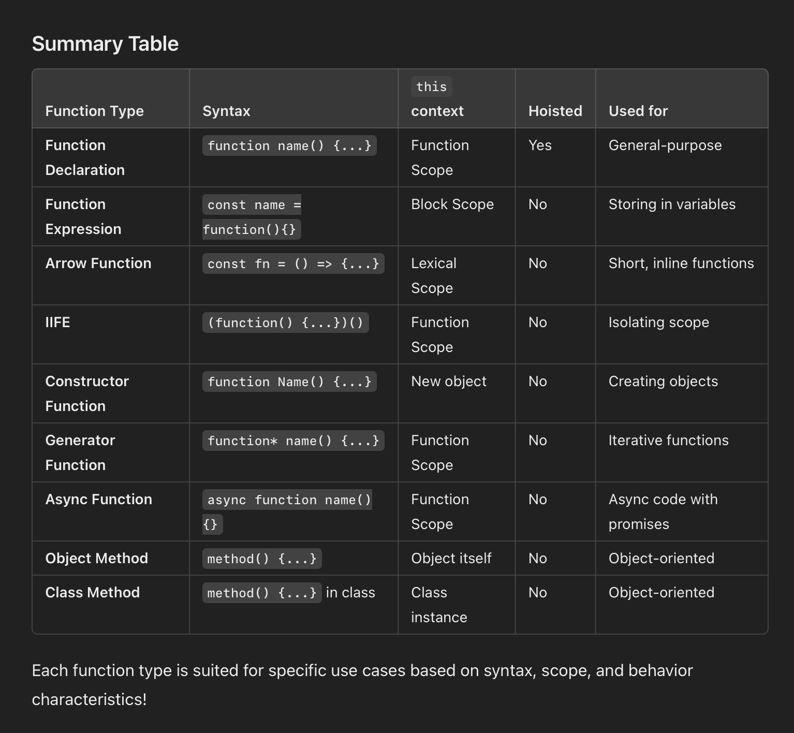

# DialogsAB_JS

Notes | JavaScript

> [!TIP]
> Some basic Git commands are:
>
> - git status
> - git add
> - git commit

## Useful links

Link to the formatting tips: [Formatting Tips](https://docs.github.com/en/get-started/writing-on-github/getting-started-with-writing-and-formatting-on-github/basic-writing-and-formatting-syntax#referencing-external-resources).

Link to the emojis: [Formatting Tips](https://github.com/ikatyang/emoji-cheat-sheet/blob/master/README.md#objects/).

## 1st lesson topics :memo:

**1. topic**

**2. topic**

**3. topic**
https://htmlpreview.github.io/

<!-- <link rel="stylesheet" href="/Users/irina/Downloads/DialogsAB/DialogsAB_JS/Class_03/styles/mystyle.css"> -->
<!-- <link rel="stylesheet" href="Class_03/styles/mystyle.css"> -->
<link rel="stylesheet" href="./styles/mystyle.css">
<!-- <link rel="stylesheet" href="/Users/irina/Downloads/DialogsAB/DialogsAB_JS/Class_03/styles/mystyle.css"> -->
<!-- <link rel="stylesheet" href="https://e-vide.dialogs-ab.lv/theme/yui_combo.php?rollup/3.17.2/yui-moodlesimple-min.css"> -->

## 8.nodarbība

**Funkciju apraksts**

> [!Noderīgi linki] > https://developer.mozilla.org/en-US/docs/Learn/JavaScript/Building_blocks/Functions > https://www.w3schools.com/tags/tryit.asp?filename=tryhtml_input_test > https://chatgpt.com/share/67323625-dd14-8012-8daa-ff3ef405b4b0 > https://mixedanalytics.com/blog/list-actually-free-open-no-auth-needed-apis/

> [!TIP]
> function (event) var tikt saīsināts kā (event) =>

---

Funkcijas apraskst ar izteiksmes palīdzību netiek automātiski nolasīts (NAV HOISTED) un tā ir jānovieto pirms atsaukšanās uz funkciju:
const greet = function(name) {
return `Hello, ${name}!`;
};

---

Ja ir hoisted, tad var likt beigās un tiks nolasīts tāpat:
function greet(name) {
return `Hello, ${name}!`;
}

---

Uzreiz darbināma:
(function() {
console.log("This function runs immediately!");
})();

(); ir izpildīšanas komanda

## 9.nodarbība

**Objekti**

> [!TIP]
> "this" izmanto konkrēta objekta ietvaros!!!

person["greeting"] = function(greeting_phrase){
return greeting_phrase + " " + this.fullName() + "!";
};
// te vajag uzdot uzrunu atsevišķi, kad darbina funkciju, piemēram, person.greeting("Hello")

---

person.greating = function() {
return "Hello " + this.firstName + " " + this.lastName + "!";
};
// te jau noteikta sasveicināšanās

---

Objekts objektā:

const person = {
firstName: "John",
lastName: "Doe",
id: 1000,
fullName: function() {
return this.firstName + " " + this.lastName;},
address: {country: "Latvia", city: "Rīga"}
};

"izsaukt" objekta īpašības var 2 veidos:

1. person.address.city
2. person["address"]["city"]

Īpašības piedēvēšana objektam, kuru nevar izlabot vai inēst:
Object.defineProperty(person,"id",{value: 60, writable: false, configurable: false});

Ja gribam, varam pārkopēt īpašības citam objektam; tādā gadījumā īpašības varēs labot, neiespaidojot oriģinālo objektu (kuru nokopējām), bet tikai kopiju:

const some_other_persone = { ...person};

NEDZĒŠAMU OBJEKTU DZĒŠANA (ATBILDE NO CHATGTP):

In JavaScript, functions can be defined in multiple ways, each with distinct syntax and characteristics. Here’s a breakdown of the most common types:

1. Function Declaration
   A function declaration defines a function with a name, which can be called before its definition due to hoisting.

function greet(name) {
return `Hello, ${name}!`;
}
Characteristics:

Hoisted: Can be called before it’s defined.
Named: The function has an explicit name (greet).
Scoping: It has function scope and can access variables defined in its outer scope. 2. Function Expression
A function expression defines a function as part of an expression and is often assigned to a variable.

const greet = function(name) {
return `Hello, ${name}!`;
};
Characteristics:

Not Hoisted: Can only be called after it’s defined.
Anonymous or Named: Usually anonymous, but can have a name.
Scoping: Like a regular variable, follows block scope if defined with let or const. 3. Arrow Function
Arrow functions are a shorter syntax for writing functions. They also differ in how they handle the this context.

const greet = (name) => `Hello, ${name}!`;
Characteristics:

Concise Syntax: Ideal for shorter functions; can omit {} if there's a single expression.
Lexical this: Inherits this from the surrounding context (doesn’t create its own).
Cannot be used as constructors: Arrow functions can’t be used with the new keyword.
Variations:

Single parameter, single-line: name => Hello, ${name}!``.
Multiple parameters: (name, age) => {...}.
No parameters: () => {...}. 4. Immediately Invoked Function Expression (IIFE)
An IIFE is a function that is defined and immediately invoked, often used to create a separate scope.

(function() {
console.log("This function runs immediately!");
})();
Characteristics:

Self-executing: Runs as soon as it’s defined.
Scope Isolation: Creates a local scope, often used to avoid polluting the global scope. 5. Constructor Function
A constructor function is used to create objects, typically by combining it with the new keyword.

function Person(name, age) {
this.name = name;
this.age = age;
}

const person1 = new Person("Alice", 30);
Characteristics:

Invoked with new: Creates a new instance each time it’s called with new.
this context: this refers to the new object being created.
Return behavior: Returns the created object by default. 6. Generator Function
A generator function allows pausing and resuming function execution, enabling asynchronous flows and producing multiple values over time.

function\* generatorFunc() {
yield 1;
yield 2;
yield 3;
}

const gen = generatorFunc();
console.log(gen.next().value); // 1
console.log(gen.next().value); // 2
Characteristics:

Denoted by _: Syntax includes an asterisk (_) after function.
yield keyword: Can pause execution and resume from where it left off.
Produces an Iterator: Returns an iterator object that supports .next(). 7. Async Function
An async function allows writing asynchronous code that looks synchronous using async and await.

async function fetchData() {
const response = await fetch('https://api.example.com/data');
const data = await response.json();
return data;
}
Characteristics:

Returns a Promise: Always returns a Promise, resolving to the function’s return value.
Await keyword: Can use await to pause execution until the Promise resolves. 8. Method Definitions in Objects
Functions can also be defined as methods within objects. This shorthand syntax is often used in ES6 and later.

const person = {
name: "Alice",
greet() {
return `Hello, ${this.name}!`;
}
};
Characteristics:

Method Syntax: The function is defined directly in the object.
this context: Refers to the object it’s called on (person in this case). 9. Class Method
In ES6+, functions can also be defined within classes as methods.

class Person {
constructor(name) {
this.name = name;
}

    greet() {
        return `Hello, ${this.name}!`;
    }

}
Characteristics:

Class-bound methods: Defined within a class.
this context: Refers to the instance of the class.
Not hoisted: Like classes, these methods are not hoisted. 10. Callable Object Pattern
JavaScript doesn’t support “callable objects” directly, but you can simulate this by creating an object with a function property or using Proxy.

const callableObj = {
call() {
console.log("Called as a function!");
}
};

callableObj.call(); // "Called as a function!"
Characteristics:

Simulates callable behavior by adding a function as a property.
Proxy-based callability: Advanced use cases can use Proxy to make objects behave more like functions.
Summary Table
Function Type Syntax this context Hoisted Used for
Function Declaration function name() {...} Function Scope Yes General-purpose
Function Expression const name = function(){} Block Scope No Storing in variables
Arrow Function const fn = () => {...} Lexical Scope No Short, inline functions
IIFE (function() {...})() Function Scope No Isolating scope
Constructor Function function Name() {...} New object No Creating objects
Generator Function function\* name() {...} Function Scope No Iterative functions
Async Function async function name() {} Function Scope No Async code with promises
Object Method method() {...} Object itself No Object-oriented
Class Method method() {...} in class Class instance No Object-oriented
Each function type is suited for specific use cases based on syntax, scope, and behavior characteristics!

You said:
JavaScript: how to delete property with configurable set as false?
ChatGPT said:

ChatGPT
In JavaScript, if a property has its configurable attribute set to false, it cannot be deleted. Attempting to delete such a property using the delete operator will silently fail in non-strict mode and throw an error in strict mode.

Here are the key details and options you can consider:

1. Understand the configurable Attribute
   When configurable is set to false:

The property cannot be deleted.
Its property descriptor (except for writable and value attributes of data properties) cannot be changed.
For example:

const obj = {};
Object.defineProperty(obj, 'prop', {
value: 42,
configurable: false
});

delete obj.prop; // Fails silently in non-strict mode
console.log(obj.prop); // 42 2. Check if the Property is Configurable
Use Object.getOwnPropertyDescriptor() to check the configurable attribute of the property:

const descriptor = Object.getOwnPropertyDescriptor(obj, 'prop');
console.log(descriptor.configurable); // false 3. Options for Dealing with Non-Configurable Properties
a. Recreate the Object (if possible)

If you need to delete a non-configurable property and cannot directly do so, a workaround is to create a new object without that property.

Example:

const obj = {
prop1: 42,
prop2: 84
};

Object.defineProperty(obj, 'prop1', { configurable: false });

// Recreate the object without `prop1`
const newObj = { ...obj }; // Shallow copy
delete newObj.prop1; // This works because the new object doesn't carry `prop1`'s descriptor

console.log(newObj); // { prop2: 84 }
Note: This approach only works for properties that can be shallow-copied and may not preserve prototype chains or deep structures.

b. Avoid Making Properties Non-Configurable

If you control the object creation or property definition, avoid setting configurable: false unless strictly necessary.

4. Why configurable: false is Immutable
   The configurable attribute is part of the ECMAScript specification. Once set to false, it cannot be reverted to true. This behavior ensures property immutability in certain contexts, such as built-in JavaScript objects or libraries.

Conclusion
If a property is already non-configurable:

You cannot delete it directly.
You can recreate the object without the property if modification is necessary.
Use configurable: false only when you need to protect properties from accidental changes or deletions.

https://chatgpt.com/share/67323625-dd14-8012-8daa-ff3ef405b4b0

https://chatgpt.com/share/67323625-dd14-8012-8daa-ff3ef405b4b0

## 10.nodarbība

**Objektu attēlošana**

https://www.w3schools.com/js/js_object_display.asp

**Objektu konstruktori**

https://www.w3schools.com/js/js_object_constructors.asp

**Objektu klases**

https://developer.mozilla.org/en-US/docs/Learn/JavaScript/Objects/Classes_in_JavaScript

https://developer.mozilla.org/en-US/docs/Glossary/Polymorphism

https://developer.mozilla.org/en-US/docs/Glossary/Encapsulation

## 12.nodarbība

Noderīgi linki

https://www.javascripttutorial.net/javascript-bom/
https://www.javascripttutorial.net/javascript-bom/javascript-location/
https://www.hostinger.com/tutorials/domain-vs-hosting
https://developer.mozilla.org/en-US/docs/Web/API/ScreenDetailed
https://www.javascripttutorial.net/javascript-bom/javascript-history/

